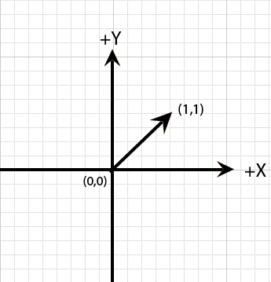
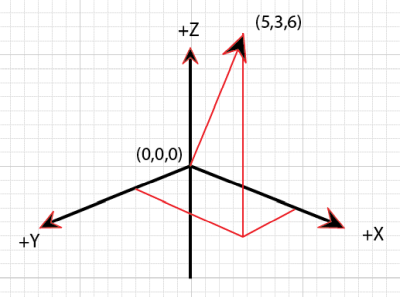
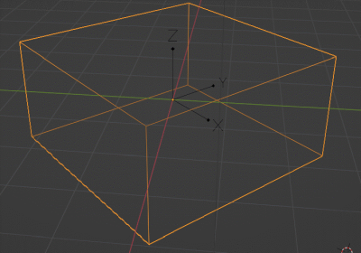
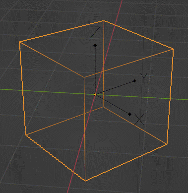
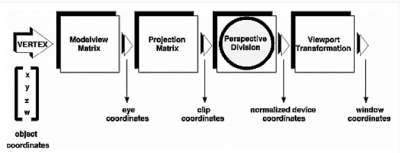
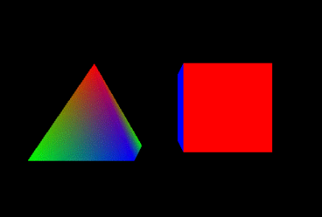
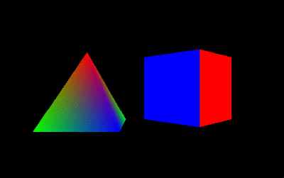

# 2D and 3D space computer graphics

If you are into computer graphics, you will notice that every graphic pipeline uses linear transformation using matrices and vectors to describe the 3D scene to be rendered. However, there are no good explanations on what these matrices are exactly, or how do they work.

To tell you the truth, this is something that you learn along the way once you get into vectors and linear algebra. But I will try my best describing it to you.

## What is a vector?

A vector can represent a direction or a point in space. It can be used to describe the magnitude of a force and it's direction, the distance of a point in space from the origin, etc.  It can be represented geometrically using an arrow, or a point. In a one-dimensional space this would be in a straigth line. In a two dimensional space, this is inside of a plane. In a three dimensional space, this is inside of a cube (Always asuming a cartesian coordinate system). For instance:



This graphic can represent a vector (the arrow pointing to (1,1)) inside a two dimensional space (Usually represented with the symbol $ \mathbb{R}^2 $). Each value represent the end point of the vector in this space, being $x=1$ and $y=1$, and it's origin being (0,0), which is the origin. Vectors don't necessarily have to be centered at the origin like in this case, but for the sake of simplicity let's asume they do, since in computer graphics all vectors are centered at the origin of the scene.

## 2D vectors

This vector can be described in two three ways, one is like this:
$$v = <1,1>$$
This tells us that this is a vector (called $v$) that points to (1,1) from the origin of the space. Each value of the vector is called a **component** of the vector, that corresponds to the corresponding axis. The generic way to represent a 2D vector would be:

$$v=<x,y>$$

Where x is the x component and y is the y component. I will explain the other two ways to describe a vector later.

## Length (norm)

Vectors have two main properties you need to be aware of: their **length** (also called the **norm** of the vector), and their **direction**. The length of the vector is easy to calculate, as it is the length of the line. If you remember this from geometry and trigonometry, and thinking about the vector as a *line* from the origin to the vector's end point, If we were to draw two lines (one that is horizontal crossing the initial point and another one that is vertical crossing the end point of this line) then we would have a *triangle*, and the vector line would be the hypotenuse.


The length of each side of the triangle corresponds to the corresponding component of the vector. The opposite side corresponds to the y axis, and the adjacent side (the bottom leg) corresponds to the x axis. So in this case both sides are 1, and by pythagoras we know that the length of the vector is:

$$
||v|| = \sqrt{1^2+1^2} = \sqrt{2}
$$

This is often called the **norm** of the vector, which in this case equals $\sqrt{2}$.

## Normalization

One important operation regarding vectors is the **normalization** of the vector. In this process, we are interested in obtaining a vector from another one whose direction is the same, but whose length is exactly 1. This can be achieved by multiplying each component of the vector by the reciprocal of it's norm.

$$ u = v\frac{1}{||v||} $$

For instance, in this case, a normalized vector would be:

$$
u = v\frac{1}{\sqrt{2}} = \displaystyle{<\frac{1}{\sqrt{2}},\frac{1}{\sqrt{2}}>}
$$

Sure enough, if you calculate the norm of $u$, you'd get 1:

$$
||u|| = \sqrt{(\frac{1}{\sqrt{2}})^2+(\frac{1}{\sqrt{2}})^2} = \sqrt{\frac{1}{2} + \frac{1}{2}} = \sqrt{1} = 1
$$

## Direction

A vector that is not zero (that is, if the length is not zero, or if at least one of the components is non-zero) can be represented using trigonometric expressions, as long as it is in the origin of the space. Like we did earlier, we can express the vector as the hypotenuse of a triangle, and this means there is an angle ($\phi$). So the x component corresponds to the cosine of %\phi%, and the y component corresponds to the sine of $\phi$. So the vector would be the product of the norm (length) times each of the components:

$$v = ||v|| \displaystyle<sin \phi, cos \phi>$$


## Unit vector

A unit vector is a vector whose length is exactly 1. For instance:

$$
î = <1,0>\\
j = <0,1>
$$

are both unit vectors. Normalized vectors are also unit vectors.

## Arithmetical operations involving vectors

You can add or subtract vectors by performing said operation among all of the components of the vectors. For instance, let v and w be two vectors, $v = <2,0>$ and $w = <1,5>$. Then:

$$
v+w = <2+1, 0+5> = <3, 5>\\
v-w = <2-1, 0-5> = <1, -5>\\
v\pm w = <vx \pm wx, vy \pm wy>
$$

Always as long as the dimensions of the vectors are the same (2 dimensions in this case).

Multiplications and divisions are a little bit more complicated. For now, let's just define a multiplication of a vector with a **scalar**, and leave divisions defined as a multiplication of a vector with the reciprocal of a scalar.

There is a little bit more to this, but let's leave it like this for now.

## Scalars

Scalars are constant values that are multiplied to the vector, and make them increase their length by a constant value. For instance:

$$
2v = <2*vx, 2*vy>
$$

In this case, 2 is a **scalar** of $v$, which makes $v$ grow twice as long as it's components are multiplied by two. Divisions of scalars can be achieved by multiplying by the reciprocal of the scalar:

$$
\frac{1}{2}v = <\frac{1}{2}*vx, \frac{1}{2}*vy>
$$

## 3-Dimensional vectors

3 dimensional vectors ($\mathbb{R}^3$) are the same, except they have 3 components instead of two. They work practically the same except their representation is in 3D using an axis that represents *depth*.



This vector can be represented as

$$
v = <5,3,6>
$$

Or to be more specific, $x = 5, y = 3, z = 6$.

## Confusion with the axes

There can be a little bit of confusion with the axes. In 2D, the Y axis represents *height* and the x axis represents the *width*. In 3D, the Y axis represents *depth*, the x axis represents *width*, and the z axis represents *height*.

However, in 3D sofware like videogames and such, you will notice that it's the Y axis the one in charge of the height, while the Z axis represents the depth. In fact, the depth is calculated using a *z-buffer*, called like that because it represents the distance of each vertex from the origin of the z axis.

This is just to make computer graphics more intuitive. Your graphic pipeline must represent (also called a *projection*) a 3D space in a 2D surface, which is your screen. Because this screen is 2D, it's height corresponds to the Y axis and the width corresponds to the X axis. So in the 3D space we use the Y axis and X axis for height and width, and the z axis for the depth.

## The other two ways to represent a vector

Finally, I left the other two ways to represent a vector for the last thing. We know that one way would be like this:

$$v = <5,3,6>$$

The second way is using a *linear combination* of each of it's component, times the unit vector corresponsing to that component. Remember that the unit vectors are vectors of length 1 like these:

$$
î = <1,0,0>\\
j = <0,1,0>\\
k = <0,0,1>
$$

So a vector $v = <5,3,6>$ can be represented like this:

$$
5î + 3j + 6k 
$$

Which is the same but represented as a linear combination. And the last way to represent a vector, is using a *matrix*. It can be represented as either a row vector, or a column vector.

$$
v = \displaystyle{\begin{bmatrix}5&3&6  \end{bmatrix}}
$$

$$
w = \displaystyle{\begin{bmatrix}5\\3\\6  \end{bmatrix}}
$$

In these examples, $v$ would be a *row vector* and $w$ would be a *column vector*. In 3D graphics, vectors are normally represented as a column vector, though some operations might use row vectors instead. Normally to represent parametric surfaces.

If you are still alive after all this complicated math, I regret to inform you that we're only half way there. There is still much more! And be aware, this is actually the *abridged version*. Now comes the important part!

## Matrices

Matrices are collections of numbers or variables organized in boxes of a specified size ($nxm$). In the previous section you've met two matrices, being $v$ a 1x3 matrix and $w$ a 3x1 matrix. You guessed it, it's *rows times columns*. You can use them to solve systems of linear equations, but they can also be used to calculate *linear transformations*, among many other uses.

The thing about matrices is that there is *a lot* about them and they are usually covered in linear algebra. A linear algebra book might be about 500+ pages covering all this stuff in depth, so I'll do my best to resume just what you need to know right now about them.

## Basic operations

You know that a matrix is a collection of numbers, could be something like this:

$$
A = \displaystyle{\begin{bmatrix}2 & 4 & 6\\1 & 3 & 5\\2 & 3 & 4  \end{bmatrix}}
$$

In this case A is a 3x3 matrix. This is, 3 rows and 3 columns. There are three basic operations you can perform on a matrix, those are called *elemental operations*. They are:

1. Switching rows. For instance, switch the first row with the second row (doesn't need to be in any particular order, you can switch them at free will).

$$
A = \displaystyle{\begin{bmatrix}1 & 3 & 5\\2 & 4 & 6\\2 & 3 & 4  \end{bmatrix}}
$$

2. Adding or subtracting a constant number of times one row to another. For instance, we can add the first row -2 times to the second row. The number of times doesn't have to be an integer, it can be any real number. Adding by a negative number of times results in a subtraction.

$$
A = \displaystyle{\begin{bmatrix}1 & 3 & 5\\0 & -2 & -4\\2 & 3 & 4  \end{bmatrix}}
$$

3. Multiplying a row by a scalar. For instance, multiplying the second row by $-\frac{1}{2}$. Again, the scalar can be any scalar:

$$
A = \displaystyle{\begin{bmatrix}1 & 3 & 5\\0 & 1 & 2\\2 & 3 & 4  \end{bmatrix}}
$$

The examples showcased here had these operations performed in the specified order. Naturally, those operations can be performed in any order, any number of times.

## Row Echelon Form (ref)

The resultant matrix from the previous operation:

$$
A = \displaystyle{\begin{bmatrix}1 & 3 & 5\\0 & 1 & 2\\2 & 3 & 4  \end{bmatrix}}
$$

Could be represented in ref if we perform the following operations to it: adding the first row to the last one -2 times, and adding the second row to the last 3 times.

$$
A = \displaystyle{\begin{bmatrix}1 & 3 & 5\\0 & 1 & 2\\0 & 0 & 0  \end{bmatrix}}
$$

Why we know this matrix is in *row echelon form*? Well, it has three properties:

1. Each row has a leading 1. Every value that is not a 1 at the left side, is a zero.
2. Every subsecuent row that has a leading 1, have their leading 1 at the right of the previous row.
3. If there is a row that has no leading 1, it is at the bottom of the matrix.

When a matrix at least the first two properties (or all of them), then we say it's in row echelon form.

## Reduced row echelon form (rref)

A reduced row echelon matrix has the same properties as a row echelon matrix, and one more property:

4. When a column has a 1, every other value at that column must be a zero.

In other words, a reduced row echelon matrix could look like this:

$$
A = \displaystyle{\begin{bmatrix}1 & 0 & 0 & 0\\0 & 1 & 0&0\\0 & 0 & 0 & 1\\0&0&0&0  \end{bmatrix}}
$$

Or like this:

$$
A = \displaystyle{\begin{bmatrix}1 & 0 & 0 \\0 & 1 & 0\\0 & 0 & 1  \end{bmatrix}}
$$

## Matrix arithmetics

Matrices can be added or subtracted, but only **if their sizes are the same**. For example, you can add two matrices that are 3x4 together, but you can not add a matrix that is 3x4 with another one that is 4x2 because their sizes do not match. The result is a matrix with all the elements added together.

$$
A = \displaystyle{\begin{bmatrix}3 & 2 & 1 \\4 & 3 & 2\\2 & 4 & 6  \end{bmatrix}}
\\
B = \displaystyle{\begin{bmatrix}1 & 2 & 3 \\4 & 5 & 6\\7 & 8 & 9  \end{bmatrix}}
\\
A+B = \displaystyle{\begin{bmatrix}4 & 4 & 4 \\8 & 8 & 8\\9 & 12 & 15  \end{bmatrix}}
\\
A-B = \displaystyle{\begin{bmatrix}2 & 0 & -2 \\0 & -2 & -4\\-5 & -4 & -3  \end{bmatrix}}
$$

## Product of matrices

You can multiply two matrices, but only if the number of columns of the matrix at the left is equal to the number of rows of the matrix at the right. The resultant matrix is another matrix with the number of rows of the matrix at the right, and the number of columns of the matrix at the left.

For instance, let's use the following matrices:

$$
A = \displaystyle{\begin{bmatrix}3 & 2 & 1 \\4 & 3 & 2\\2 & 4 & 6  \end{bmatrix}}\\
B = \displaystyle{\begin{bmatrix}5 & 4 \\1 & 0\\3&3  \end{bmatrix}}
$$

A is a 3x3 matrix and B is a 3x2 matrix. The number of columns of A matches the number of rows of B, so the product AB is defined and the result is a 3x2 matrix. To perform the product AB:

$$
AB = \displaystyle{\begin{bmatrix}3 & 2 & 1 \\4 & 3 & 2\\2 & 4 & 6  \end{bmatrix}\begin{bmatrix}5 & 4 \\1 & 0\\3&3  \end{bmatrix}}
$$

You take each individual row of A, let's call it Ar. Then, for every row in A (Ar), you take each individual column of B, let's call it Bc. Then, you multiply each element of Ar with each element of Bc, and add them together. To put it into perspective, if the first row of AB is $ABr_0$, the first element $ab_{00}$ of this row would be the product of $Ar_0$ and $Bc_0$. This is:

$$
ab_{00} = Ar_0 Bc_0 = \displaystyle{\begin{bmatrix}3 & 2 & 1  \end{bmatrix}\begin{bmatrix}5 \\ 1 \\ 3  \end{bmatrix} = (3*5)+(2*1)+(1*3)=20}
$$

The next element ($ab_{01}$) is

$$
ab_{01} = Ar_0 Bc_1 = \displaystyle{\begin{bmatrix}3 & 2 & 1  \end{bmatrix}\begin{bmatrix}4 \\ 0 \\ 3  \end{bmatrix} = (3*4)+(2*0)+(1*3)=15}
$$

Now you take the next row in A ($Ar_1$) and calculate the next row in AB:

$$
ab_{10} = Ar_1 Bc_0 = \displaystyle{\begin{bmatrix}4 & 3 & 2  \end{bmatrix}\begin{bmatrix}5 \\ 1 \\ 3  \end{bmatrix} = (4*5)+(3*1)+(2*3)=29}
$$

$$
ab_{11} = Ar_1 Bc_1 = \displaystyle{\begin{bmatrix}4 & 3 & 2  \end{bmatrix}\begin{bmatrix}4 \\ 0 \\ 3  \end{bmatrix} = (4*4)+(3*0)+(2*3)=22}
$$

Finally, you take the last row in A ($Ar_2$) and do the same:

$$
ab_{20} = Ar_2 Bc_0 = \displaystyle{\begin{bmatrix}2 & 4 & 6  \end{bmatrix}\begin{bmatrix}5 \\ 1 \\ 3  \end{bmatrix} = (2*5)+(4*1)+(6*3)=32}
$$

$$
ab_{21} = Ar_2 Bc_1 = \displaystyle{\begin{bmatrix}2 & 4 & 6  \end{bmatrix}\begin{bmatrix}4 \\ 0 \\ 3  \end{bmatrix} = (2*4)+(4*0)+(6*3)=26}
$$

So the result is

$$
AB = \displaystyle{\begin{bmatrix}ab_{00} & ab_{01} \\ab_{10} & ab_{11}\\ab_{20} & ab_{21}  \end{bmatrix}} =  \displaystyle{\begin{bmatrix}20 & 15 \\29 & 22\\32 & 26  \end{bmatrix}}
$$

Complicated? Not really! It looks more complicated than it really is when put like this on paper, but try practicing on your own and you will soon get the hang of it.

Just put the two matrices together, put your left index finger on the first row of A, then your right index finger on the first column of B. Multiply each element to it's corresponding entry in the other, and add the results to gether. Then move your right index finger to the next column and repeat. Repeat this process until you've run out of columns in B, then move your left index to the next row in A, and your right index to the first column of B, and repeat again. Do that until you've ran out of rows in A.

## Scalar

Like vectors, matrices can also be multiplied with a scalar in the exact way. Just multiply all the elements of the matrix with the scalar. For instance: 

$$
2A = 2\displaystyle{\begin{bmatrix}3 & 2 & 1 \\4 & 3 & 2\\2 & 4 & 6  \end{bmatrix} = \begin{bmatrix}6 & 4 & 2 \\8 & 6 & 4\\4 & 8 & 12  \end{bmatrix}}
$$

## Algebraic properties of the matrices

Matrices share some algebraic properties with regular numbers, but there are differences you have to mind. For instance, they share the commutative property, as well as the associative property.

$$
A+B = B+A\\
A + (B+C) = A+(B+C)
$$

But mind you that when doing products, **the order is important**. So AB is *not always* the same as BA. So when thinking about the distributive property, always mind the order of the matrices in the products. Those two are **NOT** the same.

$$
A(B \pm C) = AB \pm AC\\
(B \pm C)A = BA \pm CA
$$

Finally, the asociative property also holds for scalars and matrices. Let a and b be two scalars not equal to 0:

$$
a(bC) = (ab)C\\
a(BC) = (aB)C = B(aC)
$$

But have in mind that:

$$
a(BC) \neq a(CB)
$$

for the reason stated above.

## The identity matrix

The identity matrix is a special matrix that is in rref form and whose main diagonal is all ones. For instance, a 4x4 (they are always square) identity matrix would look like this:

$$
I_4 = \displaystyle{\begin{bmatrix}1 & 0 & 0 & 0 \\0 & 1 & 0 & 0\\0 & 0 & 1 & 0\\0&0&0&1  \end{bmatrix}}
$$

The size is not always specified, in which case it's either trivial, or it's the same size of whatever matrix you're operating with. You might have heard of this name if you've seen some OpenGL code. The function ` glLoadIdentity() ` refers to this special matrix.

This matrix is very useful for many operations, and is the initial matrix you get when you start a new scene in OpenGL. Also a very important note, if you multiply this matrix with another one, you get the other matrix (burn this in your mind):

$$
IA = AI = A
$$

This is one of the special cases where the order of the product doesn't matter.

## The zero matrix

This is pretty straight forwards because... this is just a matrix, with a zero in all of it's elements! It's represented with a bold zero:

$$
\mathbf{0}_4 = \displaystyle{\begin{bmatrix}0 & 0 & 0 & 0 \\0 & 0 & 0 & 0\\0 & 0 & 0 & 0\\0&0&0&0  \end{bmatrix}}
$$

And it is also pretty straight forward because if you multiply anything by the zero matrix, it becomes a zero matrix as you would expect. The order also doesn't matter since it's zero.

$$
\mathbf{0}A = A\mathbf{0} = \mathbf{0}
$$

## Elemental Matrix

Is an identity matrix that had one and only one elemental operation performed on it. For instance:

$$
E = \displaystyle{\begin{bmatrix}-1 & 0 & 0 & 0 \\0 & 1 & 0 & 0\\0 & 0 & 1 & 0\\0&0&0&1  \end{bmatrix}}
$$

is an elemental matrix because it is an identity matrix, but the first row was multiplied times $-1$. If more than one elemental operation is applied, then it is not an elemental matrix.

## Inverse matrix

Matrices can have an inverse matrix, although this isn't guaranteed. They might or might not have an inverse. And no, it is not the result of multiplying by a -1 scalar. I wish it was that simple...

Without going too in-depth into this (trust me, there is a lot into this), as a rule of thumb, if the *determinant* of the matrix is not 0, then it has an inverse. For a 2x2 matrix, like:

$$
A = \displaystyle{\begin{bmatrix}a&b\\c&d \end{bmatrix}}
$$

You can say that if $ad-bc \neq 0$, then there is an inverse. And the inverse can be found with the following formula:

$$
A^{-1} = \frac{1}{ad-bc}\displaystyle{\begin{bmatrix}d&-b\\-c&a \end{bmatrix}}
$$

Example:

$$
A = \displaystyle{\begin{bmatrix}6&1\\5&2 \end{bmatrix}}
$$

The determinant is:

$$
6(2)-1(5) = 7 \neq 0
$$

So the inverse exist and is equal to:

$$
A^{-1} = \frac{1}{7}\displaystyle{\begin{bmatrix}2&-1\\-5&6 \end{bmatrix} = \begin{bmatrix}\frac{2}{7}&-\frac{1}{7}\\-\frac{5}{7}&\frac{6}{7} \end{bmatrix}}
$$

How do we know this is true? Well, rules say that if you multiply a matrix by it's inverse, then the result is the identity matrix.

$$
AA^{-1} = A^{-1}A = I
$$

And sure enough:

$$
AA^{-1} = \begin{bmatrix}6&1\\5&2 \end{bmatrix}\begin{bmatrix}\frac{2}{7}&-\frac{1}{7}\\-\frac{5}{7}&\frac{6}{7} \end{bmatrix} = \begin{bmatrix}1&0\\0&1 \end{bmatrix} = I
$$

There is another generic method to find the inverse of any matrix and it involves using the Gauss-Jordan method with the conjuction of the original matrix and the identity matrix. It isn't difficult (you can look it up if you want), but I think I overextended the text quite a bit, so I'll leave it at this.

# Describing space

So, I take it that you're still alive and breathing after all this math. Trust me, It gets much worse when you get too in-depth into it, this is only a simplification with all you need to get started. But all of this was necessary just so that I could explain this part, which is the most important. Here is when we will connect all the pieces together (and this is quite the puzzle!). What I'm about to describe here works practically the same for 2D, with exceptions. But I'm going to focus in a 3-dimensional space.

Suppose we have a 3-dimensional space ($\mathbb{R}^3$), and we want to display a cube on it. The cube has a volume of 1, so all of the vertex are at 1 unit of distance from the origin of this space.


As I said earlier, vectors can be represented as arrows in the space, but they can also be represented as points where the end point of the vector lies, if the origin of the vector is the origin of the space. So **we will think about the vertices of the cube as vector points in space, representing the end point of these vectors**. There is a total of 8 vertices, 4 at the top and 4 at the bottom (or 4 at the front and 4 at the back), and a total of 6 faces.

In other words, imagine a total of 8 beams going all the way from the origin, to each of the vertices of the cube. **Those are our vectors**. And as you can figure out by yourself, you can represent each of these vertices as a *column matrix*.

$$
v = \displaystyle{\begin{bmatrix}x\\ y\\ z  \end{bmatrix}}
$$

This is what we will use to describe the transformations using *linear transformations*.

I said that the vertices are vectors that go from the center of the space, but this is not *entirely* true. There are actually several spaces. In fact, there are *subspaces* that act as *offsets* from the *world space*. This is because the vertices are in their own space, rather than in the world space. So, when thinking about transformations, have in mind that these transformations are relative to the *object space*, not the *world space*. In the picture above, the yellow axes represent the *object space* (or *local space*), and the green and red axes represent the *world space*. There should be a blue axis in the z axis of the world space, but that one is hidden. Just imagine it is there.

## Linear transformation

Imagine we wanted to rotate our cube about 45º counter-clockwise in the z axis, relative to it's local space.


We need to rotate each and every vector 45º counter-clockwise in the z axis. This will put all of our vertices in the right position. But how we describe this operation mathematically? This is where linear algebra comes in handy.

Now think about those axes in the space. Don't they look like vectors too? In fact, they are pretty much unit vectors. Each one is 1 unit long, and their direction follows each of the axes. So we could describe those vectors as follows:

$$
X = \displaystyle{\begin{bmatrix}1\\ 0\\ 0  \end{bmatrix}}, Y = \displaystyle{\begin{bmatrix}0\\ 1\\ 0  \end{bmatrix}}, 
Z = \displaystyle{\begin{bmatrix}0\\ 0\\ 1  \end{bmatrix}}
$$

If we join them together, then we get the following matrix, which we are going to call M:

$$
M = \displaystyle{\begin{bmatrix} 1&0&0\\0&1&0\\0&0&1\end{bmatrix}}
$$

This is an identity matrix where each column corresponds to the coordinates of each axis vector. If we were to multiply each vertex with this matrix, then we would obtain the coordinates of the vertices as they are right now:

$$
MV = \displaystyle{\begin{bmatrix} 1&0&0\\0&1&0\\0&0&1\end{bmatrix}} \displaystyle{\begin{bmatrix}x\\ y\\ z  \end{bmatrix}} = \displaystyle{\begin{bmatrix}x\\ y\\ z  \end{bmatrix}}
$$

This means, our cube has no transformations and it is in it's normal state. But we want to rotate the cube 45º counter-clockwise in the Z axis. So, what would happen if the axes were rotated 45º counter-clockwise in the Z axis?


Things change a bit now because the axis vectors now lie in different points. We can observe that the X axis now lies in <1,1,0> and that Y now lies in <-1,1,0>, so:

$$
X = \displaystyle{\begin{bmatrix}1\\ 1\\ 0  \end{bmatrix}}, Y = \displaystyle{\begin{bmatrix}-1\\ 1\\ 0  \end{bmatrix}}, 
Z = \displaystyle{\begin{bmatrix}0\\ 0\\ 1  \end{bmatrix}}
$$

Which joined together form the following matrix:

$$
M = \displaystyle{\begin{bmatrix} 1&-1&0\\1&1&0\\0&0&1\end{bmatrix}}
$$

If we were to multiply each vertex with this matrix, we would obtain:

$$
MV = \displaystyle{\begin{bmatrix} 1&-1&0\\1&1&0\\0&0&1\end{bmatrix}}\displaystyle{\begin{bmatrix}x\\ y\\ z  \end{bmatrix}} = \displaystyle{\begin{bmatrix}x-y\\ x+y\\ z  \end{bmatrix}}
$$

Which would result in something... that is not exactly what we wanted.



Yes, the box rotates 45 degrees counter-clockwise in the Z axis as we wanted... but the size is wrong!

**The transformation matrix must contain unit vectors, and nothing else.** Whenever we are dealing with linear transformations, we must ensure that the matrix we are using is **normalized** before doing anything, or else this is what will happen.

If we calculate the norm of the X and Y vectors, we will find that their length is actually $\sqrt{2}$, which is not 1. So we need to *normalize* these two vectors by multiplying them with a scalar $\frac{1}{\sqrt{2}}$, leaving only the Z vector intact because it's length is  already 1.

$$
X = \displaystyle{\begin{bmatrix}\frac{1}{\sqrt{2}} \\ \frac{1}{\sqrt{2}} \\ 0  \end{bmatrix}}, Y = \displaystyle{\begin{bmatrix}-\frac{1}{\sqrt{2}}\\ \frac{1}{\sqrt{2}} \\ 0  \end{bmatrix}}, 
Z = \displaystyle{\begin{bmatrix}0\\ 0\\ 1  \end{bmatrix}}
$$

Which joined together form the following matrix:

$$
M = \displaystyle{\begin{bmatrix} \frac{1}{\sqrt{2}}&-\frac{1}{\sqrt{2}}&0\\ \frac{1}{\sqrt{2}}&\frac{1}{\sqrt{2}}&0\\0&0&1\end{bmatrix}}
$$

And multiplying with each vertex we get:

$$
MV = \displaystyle{\begin{bmatrix} \frac{1}{\sqrt{2}}&-\frac{1}{\sqrt{2}}&0\\ \frac{1}{\sqrt{2}}&\frac{1}{\sqrt{2}}&0\\0&0&1\end{bmatrix}} \displaystyle{\begin{bmatrix}x\\ y\\ z  \end{bmatrix}} = \displaystyle{\begin{bmatrix}\frac{x-y}{\sqrt{2}}\\ \frac{x+y}{\sqrt{2}}\\ z  \end{bmatrix}}
$$

Which finally rotates our cube 45 degrees counter-clockwise in the Z axis without any kind of deformation.



This can be used for any kind of transformation (except translation, which requires a translation matrix to offset the local space). For instance, if you wanted to scale the cube, say make it two times bigger, you can just multiply the identity matrix with a scalar of 2 and then multiply this matrix to each vertex. You can, of course, apply several transformations at the same time as well.

# Now the real deal...

So far I've been using screenshots from blender to describe *mathematically* the operations performed. Now it's time to put all of this into practice in the real world, for which I'm going to use an OpenGL program in C to showcase how to display and rotate objects in a 3-dimensional space. For simplicity, I will use the old standard instead of using shaders and stuff that could potentially overcomplicate everything.

But before any of that, some important things to keep in mind. From now on, the Y and Z axis are swapped together for the reason I stated earlier. OpenGL uses the Y axis for the height, and the Z axis for depth. We will have to recalculate the transformation later, but that's OK!

## The program

I will use good old GLUT to create a window with the renderer context as well as handle the resize event. This bare-bones program will do it:

```C

/*
 * lintransform.c: Example showcasing linear transformations
 */
#include <windows.h>  // for MS Windows
#include <GL/glut.h>  // GLUT, include glu.h and gl.h
#include <math.h>

char title[] = "Linear Transformation Example";

void initGL() {
   glClearColor(0.0f, 0.0f, 0.0f, 1.0f); // Set background color to black and opaque
   glClearDepth(1.0f);                   // Set background depth to farthest
   glEnable(GL_DEPTH_TEST);   // Enable depth testing for z-culling
   glDepthFunc(GL_LEQUAL);    // Set the type of depth-test
   glShadeModel(GL_SMOOTH);   // Enable smooth shading
   glHint(GL_PERSPECTIVE_CORRECTION_HINT, GL_NICEST);  // Nice perspective corrections
}

void display() {

}

/* Handler for window re-size event. Called back when the window first appears and
   whenever the window is re-sized with its new width and height */
void reshape(GLsizei width, GLsizei height) {  // GLsizei for non-negative integer
   // Compute aspect ratio of the new window
   if (height == 0) height = 1;                // To prevent divide by 0
   GLfloat aspect = (GLfloat)width / (GLfloat)height;
 
   // Set the viewport to cover the new window
   glViewport(0, 0, width, height);
 
   // Set the aspect ratio of the clipping volume to match the viewport
   glMatrixMode(GL_PROJECTION);  // To operate on the Projection matrix
   glLoadIdentity();             // Reset
   // Enable perspective projection with fovy, aspect, zNear and zFar
   gluPerspective(45.0f, aspect, 0.1f, 100.0f);
}

/* Main function: GLUT runs as a console application starting at main() */
int main(int argc, char** argv) {
   glutInit(&argc, argv);            // Initialize GLUT
   glutInitDisplayMode(GLUT_DOUBLE); // Enable double buffered mode
   glutInitWindowSize(640, 480);   // Set the window's initial width & height
   glutInitWindowPosition(50, 50); // Position the window's initial top-left corner
   glutCreateWindow(title);          // Create window with the given title
   glutDisplayFunc(display);       // Register callback handler for window re-paint event
   glutReshapeFunc(reshape);       // Register callback handler for window re-size event
   initGL();                       // Our own OpenGL initialization
   glutMainLoop();                 // Enter the infinite event-processing loop
   return 0;
}
```

If you are using GNU C, you can compile this program using:

`> gcc lintransform.c -o lintransform -lm -lGlu32 -lfreeglut -lopengl32`

If you are using MinGW on Windows. But let's talk about OpenGL for a bit.

First of all, OpenGL doesn't really have a concept of a "camera". OpenGL has a "viewport" at the origin of the scene, on which the whole scene gets projected. And what you see, is this projection. It's more like taking a picture, where the light gets projected into a plane, printing the image on it.

The pipeline goes as follows:



For the scene to appear on your screen, it must go through 4 different transformations until it can be *printed* on your screen. We are only going to use the *Modelview matrix*, which is the one in charge of handling all the transformations in the objects.

Second, our transformation matrices will not have a size of 3x3. Actually, we will be using 4 vectors with 4 components each, making it a 4x4 matrix. We will add an extra `w` component to it.

$$
M = \displaystyle{\begin{bmatrix}1&0&0&0\\ 0&1&0&0\\ 0&0&1&0\\ 0&0&0&1  \end{bmatrix}}
$$

Fear not! THis component is used only to differentiate between different operation modes, so for now we will asume this vector is always a unit vector:

$$
w = \displaystyle{\begin{bmatrix}0\\ 0\\ 0\\ 1  \end{bmatrix}}
$$

And the rest works as usual, just with 4 components (the w component always set to 0). We will also ignore this component during the transformations.

Now let's draw some objects. I could use GLUT to draw some primitives but I want to control the colors in the faces, as I won't be using any lighting or materials. The way to draw primitives by hand is to specify each face manually using the GL_TRIANGLE, GL_TRIANGLE_STRIP or GL_QUAD modes.

So, in the display function, I will add the following code:

```c
glClear(GL_COLOR_BUFFER_BIT | GL_DEPTH_BUFFER_BIT); // Clear color and depth buffers
glMatrixMode(GL_MODELVIEW);     // To operate on model-view matrix
 
// Render a color-cube consisting of 6 quads with different colors
glLoadIdentity();                 // Reset the model-view matrix
glTranslatef(1.5f, 0.0f, -7.0f);  // Move right and into the screen
glBegin(GL_QUADS);                // Begin drawing the color cube with 6 quads
      // Top face (y = 1.0f)
      // Define vertices in counter-clockwise (CCW) order with normal pointing out

      glColor3f(0.0f, 1.0f, 0.0f);     // Green
      glVertex3f( 1.0f, 1.0f, -1.0f);
      glVertex3f(-1.0f, 1.0f, -1.0f);
      glVertex3f(-1.0f, 1.0f,  1.0f);
      glVertex3f( 1.0f, 1.0f,  1.0f);
 
      // Bottom face (y = -1.0f)
      glColor3f(1.0f, 0.5f, 0.0f);     // Orange
      glVertex3f( 1.0f, -1.0f,  1.0f);
      glVertex3f(-1.0f, -1.0f,  1.0f);
      glVertex3f(-1.0f, -1.0f, -1.0f);
      glVertex3f( 1.0f, -1.0f, -1.0f);
 
      // Front face  (z = 1.0f)
      glColor3f(1.0f, 0.0f, 0.0f);     // Red
      glVertex3f( 1.0f,  1.0f, 1.0f);
      glVertex3f(-1.0f,  1.0f, 1.0f);
      glVertex3f(-1.0f, -1.0f, 1.0f);
      glVertex3f( 1.0f, -1.0f, 1.0f);
 
      // Back face (z = -1.0f)
      glColor3f(1.0f, 1.0f, 0.0f);     // Yellow
      glVertex3f( 1.0f, -1.0f, -1.0f);
      glVertex3f(-1.0f, -1.0f, -1.0f);
      glVertex3f(-1.0f,  1.0f, -1.0f);
      glVertex3f( 1.0f,  1.0f, -1.0f);
 
      // Left face (x = -1.0f)
      glColor3f(0.0f, 0.0f, 1.0f);     // Blue
      glVertex3f(-1.0f,  1.0f,  1.0f);
      glVertex3f(-1.0f,  1.0f, -1.0f);
      glVertex3f(-1.0f, -1.0f, -1.0f);
      glVertex3f(-1.0f, -1.0f,  1.0f);
 
      // Right face (x = 1.0f)
      glColor3f(1.0f, 0.0f, 1.0f);     // Magenta
      glVertex3f(1.0f,  1.0f, -1.0f);
      glVertex3f(1.0f,  1.0f,  1.0f);
      glVertex3f(1.0f, -1.0f,  1.0f);
      glVertex3f(1.0f, -1.0f, -1.0f);
   glEnd();  // End of drawing color-cube
 
   // Render a pyramid consists of 4 triangles
   glLoadIdentity();                  // Reset the model-view matrix
   glTranslatef(-1.5f, 0.0f, -6.0f);  // Move left and into the screen
 
   glBegin(GL_TRIANGLES);           // Begin drawing the pyramid with 4 triangles
      // Front
      glColor3f(1.0f, 0.0f, 0.0f);     // Red
      glVertex3f( 0.0f, 1.0f, 0.0f);
      glColor3f(0.0f, 1.0f, 0.0f);     // Green
      glVertex3f(-1.0f, -1.0f, 1.0f);
      glColor3f(0.0f, 0.0f, 1.0f);     // Blue
      glVertex3f(1.0f, -1.0f, 1.0f);
 
      // Right
      glColor3f(1.0f, 0.0f, 0.0f);     // Red
      glVertex3f(0.0f, 1.0f, 0.0f);
      glColor3f(0.0f, 0.0f, 1.0f);     // Blue
      glVertex3f(1.0f, -1.0f, 1.0f);
      glColor3f(0.0f, 1.0f, 0.0f);     // Green
      glVertex3f(1.0f, -1.0f, -1.0f);
 
      // Back
      glColor3f(1.0f, 0.0f, 0.0f);     // Red
      glVertex3f(0.0f, 1.0f, 0.0f);
      glColor3f(0.0f, 1.0f, 0.0f);     // Green
      glVertex3f(1.0f, -1.0f, -1.0f);
      glColor3f(0.0f, 0.0f, 1.0f);     // Blue
      glVertex3f(-1.0f, -1.0f, -1.0f);
 
      // Left
      glColor3f(1.0f,0.0f,0.0f);       // Red
      glVertex3f( 0.0f, 1.0f, 0.0f);
      glColor3f(0.0f,0.0f,1.0f);       // Blue
      glVertex3f(-1.0f,-1.0f,-1.0f);
      glColor3f(0.0f,1.0f,0.0f);       // Green
      glVertex3f(-1.0f,-1.0f, 1.0f);
   glEnd();   // Done drawing the pyramid
 
   glutSwapBuffers();  // Swap the front and back frame buffers (double buffering)
```

Note that I called `glMatrixMode(GL_MODELVIEW)` to specify that I want to use the Model view matrix for the following operations. By default, this matrix is set to a 4x4 identity matrix. Then I call `glTranslatef(1.5f, 0.0f, -7.0f);` to move the object somewhere in front of the viewport so it can be rendered. Then I describe two objects, one being a cube, and another one being a pyramid. Those go between calls to `glBegin(GL_QUADS)` and `glBegin(GL_TRIANGLES)` respectively, and `glEnd()` to specify where the drawing ends. Each contains calls to `glVertex3f(x,y,z)` to describe each vertex in the geometry of the object.

There are another two functions in between I want you to pay attention to: `glLoadIdentity()` and `glTranslatef(x,y,z)`. The first sets the model view matrix back to the identity matrix. The last translates this matrix to another position, before drawing the pyramid.

All of this produces the following scene:



We are going to rotate the cube 45 degrees counter-clockwise in it's Y axis. Remember! In OpenGL (and videogames), the Y axis is the height, and the Z axis is the depth, so we need to recalculate the vectors because the previous one will not do what we want. We will also account for the $w$ vector as well.

We have:

$$
X = \displaystyle{\begin{bmatrix}1\\ 0\\ 0\\0  \end{bmatrix}}, Y = \displaystyle{\begin{bmatrix}0\\ 1\\ 0\\0  \end{bmatrix}}, 
Z = \displaystyle{\begin{bmatrix}0\\ 0\\ 1 \\ 0  \end{bmatrix}},
W = \displaystyle{\begin{bmatrix}0\\ 0\\ 0\\1  \end{bmatrix}}
$$

If we rotate the axis as we want, the X axis would lie in <1,0,1,0> and the Z axis would lie in <-1,0,1,0>. We will have to normalize these two vectors so we will multiply them by a scalar of $\frac{1}{\sqrt{2}}$ to obtain:

$$
X = \displaystyle{\begin{bmatrix}\frac{1}{\sqrt{2}}\\ 0\\ \frac{1}{\sqrt{2}}\\0  \end{bmatrix}}, Y = \displaystyle{\begin{bmatrix}0\\ 1\\ 0\\0  \end{bmatrix}}, 
Z = \displaystyle{\begin{bmatrix}-\frac{1}{\sqrt{2}}\\ 0\\ \frac{1}{\sqrt{2}} \\ 0  \end{bmatrix}},
W = \displaystyle{\begin{bmatrix}0\\ 0\\ 0\\1  \end{bmatrix}}
$$

Which produces the matrix:

$$
M = \displaystyle{\begin{bmatrix}
\frac{1}{\sqrt{2}}&0&-\frac{1}{\sqrt{2}}&0\\
0&1&0&0\\
\frac{1}{\sqrt{2}}&0&\frac{1}{\sqrt{2}}&0\\
0&0&0&1
\end{bmatrix}}
$$

Multiplying with each vector we get:

$$
M = \displaystyle{\begin{bmatrix}
\frac{1}{\sqrt{2}}&0&-\frac{1}{\sqrt{2}}&0\\
0&1&0&0\\
\frac{1}{\sqrt{2}}&0&\frac{1}{\sqrt{2}}&0\\
0&0&0&1
\end{bmatrix}}
\displaystyle{\begin{bmatrix}
x\\ y \\ z \\ w
\end{bmatrix}} = \displaystyle{\begin{bmatrix}
\frac{x-z}{\sqrt{2}}\\ y \\ \frac{x+z}{\sqrt{2}} \\ w
\end{bmatrix}}
$$

Which is the same as before, but swapping the Y and Z axes. By modifying the display function as follows:

```c
/* Describes a 45º counter-clockwise rotation of 45 degrees in the Y axis */
GLfloat rotm[] = {
      1/sqrtf(2.0), 0, -1/sqrtf(2.0), 0,
      0, 1, 0, 0,
      1/sqrtf(2.0), 0, 1/sqrtf(2.0), 0,
      0, 0, 0, 1
   };

glClear(GL_COLOR_BUFFER_BIT | GL_DEPTH_BUFFER_BIT); // Clear color and depth buffers
glMatrixMode(GL_MODELVIEW);     // To operate on model-view matrix
 
// Render a color-cube consisting of 6 quads with different colors
glLoadIdentity();                 // Reset the model-view matrix
glTranslatef(1.5f, 0.0f, -7.0f);  // Move right and into the screen

   glMultMatrixf(rotm);              // Rotate the cube 45º CC
```

we can observe that indeed, the cube rotates as we want:



Please be aware that **this is not the proper way to rotate objects in OpenGL**. This is only a demonstration on how the transformation works using matrices.

If you want to rotate an object then use the ```glRotatef(deg,x,y,x)``` function instead, which rotates *deg* degrees around a vector specified by the *x*,*y* and *z* coordinates (must be normalized first).